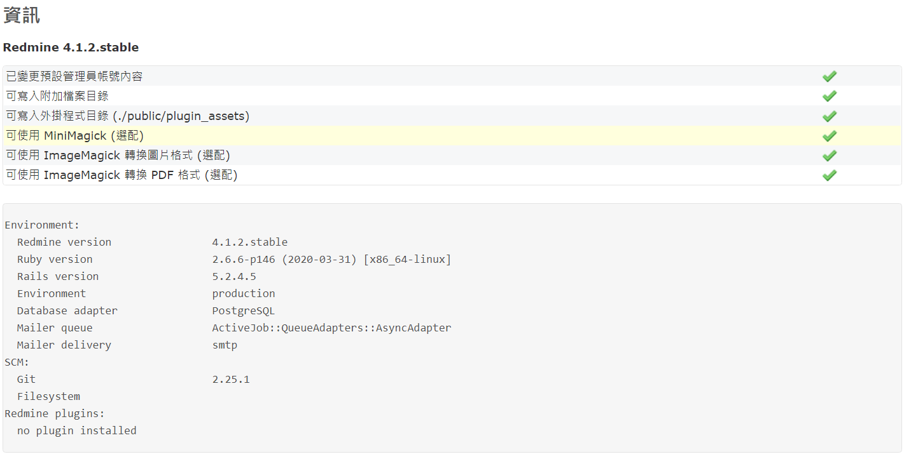

# Redmine

## check version

[How to check redmine version](https://www.redmine.org/boards/2/topics/21974)

Method 1:

Go to `http://127.0.0.1/admin/info`, it will be something like this:



Method 2:
```
view doc/CHANGELOG
```

On the top, it will be something like this:
```
== Redmine changelog

Redmine - project management software
Copyright (C) 2006-2021  Jean-Philippe Lang
https://www.redmine.org/

== 2021-03-21 v4.1.2
...
```

Method 3:

```sh
view lib/redmine/version.rb
```

On the top, it will be something like this:

```ruby
...
module Redmine
  # @private
  module VERSION
    MAJOR = 4
    MINOR = 1
    TINY  = 2
```
